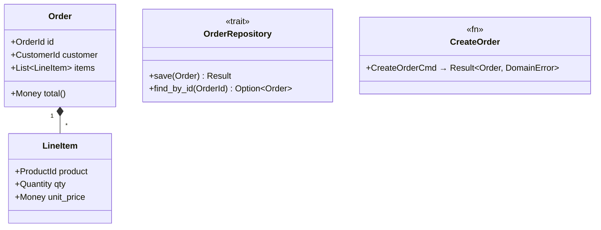

# Plan

## When to use
- User enters plan mode or asks to plan before implementing
- Problem is complex, spans multiple sessions, or requires design decisions
- User asks to create a workspace, design doc, ADR, or task breakdown
- User asks to integrate workspace artifacts into durable storage
- User asks to review or amend an existing design or workspace

## Goal

Planning must always take less time than implementation. The effort scales with complexity, never the other way around.

**Who does what**:
- The **agent** does the heavy lifting: explores the codebase, drafts DESIGN.md, builds the domain model, writes tasks, runs pre-flight
- The **human** reviews, makes decisions (ADRs), and says "go"

**Human time budget** (for a 2–4H implementation session):
- Phase 2 — DESIGN.md: ~10 min — review requirements, confirm scope
- Phase 3 — ADRs: ~10 min — make the hard decisions the agent cannot
- Phase 4b — Tasks: ~10 min — review task goals and constraints
- Phase 4c — Pre-flight: ~5 min — final approval before autopilot
- **Total: ~30–40 min of human attention buys 2–4H of uninterrupted autopilot**

Everything else (exploring the codebase, drafting documents, building the domain model, writing tasks, running pre-flight checks) is agent work.

**Why this pays off**: without planning, the agent stops mid-autopilot on an outside-constitution gap. The human must context-switch, understand the problem, make a decision, and restart the agent. One interruption costs more than the entire planning phase — and it often cascades into more interruptions.

## Delegation model

This skill is **explicitly orchestrated** — do not run every phase inline on the main thread. The main agent is the **orchestrator**: it stays responsive to the human, holds a small context, and delegates heavy work to subagents. Prescribe delegation; do not rely on it emerging.

- **Phase 4a (Analysis)** — fan out read-only `Explore` subagents **in parallel**, one per axis (domain model, build/test/lint commands, interfaces/contracts, dependencies, existing patterns). Each burns its own context and returns structured findings; the orchestrator synthesizes the `## Analysis` section.
- **Phases 2–3 (Design/ADRs)** — for a genuinely contested decision, spawn parallel agents arguing each viable option (judge panel), then synthesize the ADR. For simple decisions, draft inline.
- **Phase 5 (Implementation)** — execute via the **deterministic Workflow loop** (one fresh-context subagent per task). The orchestrator launches it, monitors, re-runs checkpoints, and surfaces gaps — it does **not** implement inline.

**Why this matters**: an orchestrator that does everything inline fills its own context, triggers compaction, and loses the thread. Delegation keeps the orchestrator thin (so it rarely compacts) and gives each unit of work a fresh context (so no single window carries the whole job). This is what restores the "listen to the human while monitoring ongoing work" behavior.

## Structure

the root is `./docs`

```
docs/workspace/<NAME>/          <- temporary draft space (one folder = full context)
  adrs/                         <- draft ADRs (slug-named: <decision-slug>.md)
  DESIGN.md                     <- draft Design Doc
  TASKS.md                      <- Work Breakdown (lives and dies with workspace)

docs/<theme>/                   <- durable storage, organized by feature/theme
  README.md                     <- theme index: scope + links to its designs and ADRs
  adrs/
    YYYYMMDD_<slug>.md          <- durable ADR, date-prefixed, status accepted
  designs/
    YYYYMMDD_<name>.md          <- durable Design Doc
```

Durable ADRs and designs share one naming scheme — `YYYYMMDD_<slug>.md` — and are distinguished by their subdirectory, not by a number. There is **no global ADR counter**: the date prefix orders them and the slug keeps each unique (matching the existing design-doc convention). Pick or create the theme at integration time (Phase 6), not before.

## Document Order

Strict order — each document depends on the previous:

1. **DESIGN.md** — always first (context, FR, NFR, non-goals, design)
2. **adrs/*.md** — emerge during design (one per hard-to-reverse decision)
3. **TASKS.md** — derived from DESIGN.md (one task per FR/NFR, with acceptance criteria)

## Constitution

The **constitution** is the set of rules the agent cannot break unilaterally during implementation. It is built across Phases 2–4 and enforced during Phase 5.

The constitution is composed of:
- **Requirements** (FR/NFR) — what the system must do and under what constraints
- **ADR decisions** — hard-to-reverse choices that are settled and not open for re-evaluation
- **Domain model** — the planned types, their attributes, and relationships
- **Requirement traceability** — which types address which FR/NFR
- **Transformation invariants** — the rules each function must enforce (input → output, with the invariant that must hold)
- **External dependencies** — the crates/packages/services the project uses, no new ones without approval
- **TDD rule** — every code change requires a corresponding test: failing test first, then implementation, then green (see [TDD skill](../tdd/SKILL.md)). No code is committed without a test that proves it works.

**Within the constitution** (agent acts autonomously, no need to stop):
- Add fields or attributes to types when needed to satisfy an invariant
- Rename types or fields for clarity, as long as the traceability table intent is preserved
- Split a type into smaller types (e.g., extract a value object) when it makes the model cleaner
- Add helper functions or intermediate transformations
- Adjust signatures when a constraint requires it
- Choose how to organize code (files, modules, visibility)

**Outside the constitution** (agent stops *implementing*, then analyzes and proposes — see [Phase 5 severity 3](#phase-5--implement-autopilot)): the agent does not change these unilaterally, but it does the analysis itself and drafts a `proposed` ADR with a recommendation for the human to ratify — it hands the human a decision, not a raw problem:
- Change an ADR decision (e.g., switch from REST to gRPC, change a persistence strategy)
- Add, remove, or alter a requirement (FR/NFR)
- Violate a documented invariant or transformation rule
- Skip an acceptance criterion that cannot be met
- Introduce a new external dependency not listed in analysis

If the constitution is well-built, the agent never stops. If it's incomplete, the agent will hit an outside-constitution gap and must halt. The quality of the constitution determines the quality of the autopilot.

## Session continuity

Claude Code's built-in plan mode (`EnterPlanMode`) stores ephemeral plans in `~/.claude/plans/`. These are conversation-scoped and do not survive sessions. **Do not use built-in plan mode for this skill** — use `docs/workspace/` instead, which is project-scoped and committed to git.

To allow Claude to discover active workspaces — and to **resume after context compaction** — add a **self-describing** entry to the project's **root** `CLAUDE.md`. Root `CLAUDE.md` is re-read from disk and re-injected after compaction, `/clear`, and restart; nested `CLAUDE.md` is *not*, so the entry must live at the root.

```markdown
## Active workspaces
- [order-system](docs/workspace/order-system/TASKS.md) — Phase 5, task 4/7
  RESUME: load the `my-plan` skill, then read TASKS.md (checked = done) + `git log --oneline`;
  continue at first unchecked task; re-run the session checkpoint before trusting state.
  Per-session implementation skills are listed in TASKS.md.
```

The entry is **self-describing on purpose**. `SKILL.md` is not auto-loaded, so after compaction the only thing guaranteed to survive is root `CLAUDE.md` — it must therefore carry both the state pointer *and* the instruction to act on it. It names only the **`my-plan`** skill: the bootstrap needed to resume the protocol. The per-session implementation skills (`software-engineer`, language extensions, …) live in TASKS.md and load at session startup — naming them here would only create drift.

Update this entry **after every task** (advance `task N/M`), not just at session end — it is the durable resume anchor. Remove it when the workspace is integrated (Phase 6). See [Phase 0 — Resume](#phase-0--resume-run-on-every-start) for the full protocol.

## Rules

### Phase 0 — Resume (run on every start)

Before doing anything else — including after context compaction, `/clear`, or a new session — reconstruct state from disk. **Disk and git are the source of truth; never trust conversational memory for where work stands.**

1. Read root `CLAUDE.md` `## Active workspaces` → find the active workspace and phase.
2. If a workspace is active, load the `my-plan` skill (this file) and read its `TASKS.md`.
3. In TASKS.md: checked acceptance criteria = done; the first unchecked task is the resume point.
4. Run `git log --oneline` and the active session's checkpoint command → confirm what is actually committed and green.
5. Resume at the first unchecked task. If the checkpoint disagrees with the checkboxes, trust the checkpoint and re-open the affected task.

If no workspace is active, proceed to Phase 1.

### Phase 1 — New need

Create the workspace and register it in `CLAUDE.md`:
```bash
mkdir -p docs/workspace/<NAME>/adrs
```
Then add an entry to the project's `CLAUDE.md` under `## Active workspaces`.

### Phase 2 — Write DESIGN.md

DESIGN.md is the entry point. It must be written before anything else.

Each FR and NFR gets an anchor for cross-referencing:

```markdown
# <NAME> — Design Doc

## Context
Why this work exists.

## Functional Requirements

### <a id="fr1"></a>FR1 — Short title
Description of what the system must do.

### <a id="fr2"></a>FR2 — Short title
Description.

## Non-Functional Requirements

### <a id="nfr1"></a>NFR1 — Short title
Constraint: performance, security, availability, compliance.

## Non-goals
What this design explicitly does not address.

Before listing a non-goal, verify it is truly out of scope:
- **Already covered?** Check whether existing behavior, architecture, or a planned feature already provides the capability. If it does, it is not a non-goal — it is a fact to document (e.g., "OR composition is already provided by the first-match-wins evaluation order").
- **Deferred or excluded?** If it is genuinely not covered and not planned, state *why* it is excluded (cost, complexity, low priority) so the decision can be revisited later.
- **Misclassified FR?** If exploration reveals the capability is actually needed for the stated goals, promote it to an FR instead.

A non-goal that turns out to be already solved is a planning error — it signals incomplete analysis of the existing system.

## Rabbit holes
Areas of known uncertainty where unbounded time could be lost.
For each: state what to avoid and the constraint that caps exploration.

## Design
Architecture, C4 diagrams (levels 1-2 via Mermaid), data model, interfaces.

Decisions:
- [Decision title](./adrs/decision-name.md)

## Cross-cutting Concerns
Observability, migration, rollback.
```

### Phase 3 — Write ADRs

An ADR records any decision worth explaining. ADRs emerge during design and continue to emerge during implementation as new knowledge surfaces.

**What warrants an ADR:**
- Hard-to-reverse decisions (database choice, API style, protocol)
- Trade-offs where both options have merit (consistency vs availability, simplicity vs performance)
- Constraints inherited from external systems or business rules
- Rejected alternatives that someone might propose again later
- Conventions chosen among valid options (naming, error handling strategy, logging format)

ADRs link back to the requirements they address:

```markdown
---
status: draft
---
# Decision title

Addresses: [FR2](../DESIGN.md#fr2), [NFR1](../DESIGN.md#nfr1)

## Problem
What needs to be decided and why.

## Options
| Option | Pros | Cons |
|---|---|---|
| Option A | ... | ... |
| Option B | ... | ... |

## Decision
Which option and why.

## Consequences
What becomes easier or harder.
```

ADR status lifecycle: `draft` -> `proposed` -> `accepted` -> `superseded-by <ref>`

- `draft` — the agent is still working the decision out.
- `proposed` — the agent has finished analysis and has a recommendation, awaiting human ratification. **The agent may drive an ADR to `proposed` autonomously; only the human moves `proposed` -> `accepted`.**
- `accepted` — ratified by the human; now part of the constitution.
- `superseded-by <ref>` — replaced by a later decision.

### Phase 4 — Write TASKS.md (autopilot-ready)

Phase 4 is the highest-effort phase. Its goal: build a constitution strong enough that the agent never hits an outside-constitution gap during implementation. The agent will adapt within the constitution — that is expected and normal.

Phase 4 has three sub-phases that must be completed in order.

#### Phase 4a — Analysis

Before writing any task, explore the codebase to ground the plan in reality.

**Delegate this — do not explore inline.** Fan out read-only `Explore` subagents **in parallel**, one per axis below. Each returns structured findings; the orchestrator synthesizes them into the `## Analysis` section of TASKS.md (see template below for format). Parallel exploration keeps the orchestrator's context small and shortens wall-clock time. Axes (one subagent each):

- **Build & test commands**: exact commands to build, test, lint, format
- **Domain model**: types/structs with attributes, relationships, and requirement traceability
- **Interfaces / traits / contracts**: behavioral contracts new code must satisfy
- **Transformations**: functions that convert between types — input → output, with invariants
- **Dependencies**: external crates/packages/services, their versions and API surfaces
- **Constraints discovered**: anything the design did not anticipate

Every *planned domain type* must appear in the requirement traceability table. The agent may introduce additional implementation types as long as they serve a traced type.

If analysis reveals design gaps, go back to Phase 2/3 and update DESIGN.md and ADRs before writing tasks.

#### Phase 4b — Task specification

Each task is derived from a FR or NFR. Each task must be **self-contained**: an agent reading only that task (plus linked references) has everything it needs to execute.

Task references are clickable links to DESIGN.md anchors and relevant ADRs:

```markdown
# <NAME> — Tasks

Design: [DESIGN.md](./DESIGN.md)

## Analysis

Build: `<exact build command>` — verified green
Test: `<exact test command>` — verified green
Lint: `<exact lint command>` — verified green

### Known-failing tests
| Test | Reason | Action |
|---|---|---|
| (none — or list pre-existing failures) | | ignore / skip |

### Domain model



### Requirement traceability
| Type / Trait / Fn | Addresses | Notes |
|---|---|---|
| `Order` | [FR1](./DESIGN.md#fr1) | Aggregate root |
| `LineItem` | [FR1](./DESIGN.md#fr1) | Value object, immutable |
| `OrderRepository` | [NFR1](./DESIGN.md#nfr1) | Trait — infra implements |
| `CreateOrder` | [FR2](./DESIGN.md#fr2) | Validates invariants before persisting |

### Transformations
| Function | Input → Output | Invariant / Rule |
|---|---|---|
| `CreateOrder` | `CreateOrderCmd → Result<Order, DomainError>` | At least one line item, total > 0 |
| `Order::total` | `&self → Money` | Sum of (qty × unit_price) per line item |

## Tasks

### 1. Task title ([FR1](./DESIGN.md#fr1), [NFR2](./DESIGN.md#nfr2))
**Goal**: Why this task exists (one sentence).
**Types**: `Order`, `LineItem` — see domain model
**Constraints**: rules the implementation must respect
- [ADR: decision-name](./adrs/decision-name.md) — the constraint from this decision
- Invariant: `Order` must always have at least one `LineItem`
- Transformation: `CreateOrderCmd → Result<Order, DomainError>` must enforce total > 0
**Tests**: what to test before implementing (red → green)
- `test_order_requires_at_least_one_line_item` — creating an Order with empty items returns error
- `test_order_total_sums_line_items` — total equals sum of qty × unit_price
**Verify**: `cargo test -- test_bar && cargo clippy`
**Acceptance criteria**:
- [ ] Criterion 1 (pass/fail, no subjective language)
- [ ] Criterion 2
**Depends on**: (none) | task 2
**Time-box**: ~45 min

## Sessions

Group tasks into autonomous sessions. Each session is a contiguous block of work (target: 2–4H) that ends with a verifiable checkpoint. An agent completes one session, verifies, then proceeds to the next. Minimize the number of sessions — fewer, longer sessions mean fewer interruptions.

### Session 1 — <theme> (~2.5H)
Tasks: 1, 2, 3, 4, 5
**Skills**: `software-engineer` (+ language-specific extension for the project)
**Checkpoint**: `<exact command that proves session is complete>`
**Commit point**: yes — commit after checkpoint passes

### Session 2 — <theme> (~2H)
Tasks: 6, 7, 8
**Skills**: `software-engineer`
**Checkpoint**: `<exact command>`
**Commit point**: yes

## Quality gates (post-session review)
- [ ] Acceptance criteria: all green above
- [ ] Code review: implementation matches [DESIGN.md](./DESIGN.md) intent
- [ ] Code organization: file placement, module structure, naming conventions (refactoring pass)
- [ ] Code quality: no new complexity, clean types, no duplication
- [ ] Security review: OWASP check, dependency audit, no secrets exposed
- [ ] Observability: relevant metrics identified, dashboards/alerts in place, logging covers key paths
- [ ] Performance: NFR targets met, no regressions on critical paths, load tested if applicable
```

**Uncertainty tracking** (inspired by Shape Up's hill chart):
- `uphill` = figuring it out — the problem or approach is not yet understood. May trigger new ADRs or design changes.
- `downhill` = making it happen — the approach is clear, only execution remains.
- A task stuck `uphill` is a signal: the task is not ready for autopilot. Go back to Phase 4a — either the analysis is incomplete or the task needs splitting.
- **All tasks must be `downhill` before exiting Phase 4.** No `uphill` task may enter implementation.

Task granularity: each task should be independently completable and testable (INVEST: Independent, Negotiable, Valuable, Estimable, Small, Testable). Prefer vertical slicing — cut through all layers for a thin but complete feature.

#### Phase 4c — Pre-flight gate

Before moving to Phase 5, the entire TASKS.md must pass this gate. This is the last human checkpoint before autopilot.

**Per task**:
- [ ] Types it creates or modifies reference the domain model
- [ ] Constraints are extracted from ADRs, invariants, and transformation rules
- [ ] Tests are defined — named, with expected behavior described (these become the failing tests)
- [ ] Verify command is copy-pasteable and exits 0 on success
- [ ] Acceptance criteria are pass/fail with no subjective language
- [ ] Time-box is set (split if > 90 min)
- [ ] Dependencies on other tasks are declared
- [ ] Every planned domain type appears in the requirement traceability table
- [ ] Task is `downhill` — no uncertainty remains

**Constitution completeness**:
- [ ] Domain model covers every planned domain type in diagram and traceability table
- [ ] Every type in the traceability table maps to at least one FR or NFR
- [ ] Transformations table covers every function that enforces a domain rule
- [ ] No constraint is ambiguous enough that two reasonable agents would interpret it differently

**Autopilot readiness**:
- [ ] Build, test, and lint commands pass (green baseline) — run them now and confirm
- [ ] Known-failing tests are explicitly listed with their reason
- [ ] Every session has a `Skills` field — verify each skill name exists
- [ ] Session checkpoints are defined and ordered
- [ ] Total estimated time fits within the target session window (2–4H)

If any item fails, fix it before proceeding.

**Plan commit**: once the pre-flight gate passes, commit all workspace artifacts (`docs/workspace/<NAME>/`) with message:

```
docs(<NAME>): plan ready for autopilot

Phases 1–4 complete. DESIGN.md, ADRs, and TASKS.md pass pre-flight gate.
```

This checkpoint preserves the plan before implementation begins. The plan is the contract — it must be committed before any code changes.

### Phase 5 — Implement (autopilot)

Work through TASKS.md session by session. **Execution is delegated and deterministic — the orchestrator does not implement inline.**

**Why a Workflow loop**: inline execution has two failure modes — (a) the orchestrator fills its context, compaction fires, and the in-flight thread is lost; (b) the model fails to advance sequential work on its own. A Workflow loop fixes both: each task runs as its own **fresh-context subagent** (no single window holds all of TASKS.md), and a deterministic `for` loop advances tasks regardless of model temperament. Implementation is human-pre-approved at the Phase 4c gate, so detaching from the conversation is *intended* — and it leaves the orchestrator free to monitor and to surface gaps. The orchestrator launches the Workflow, monitors progress, and on return **re-runs the session checkpoint itself** before trusting the result.

**Session startup**: each task subagent loads every skill listed in its session's `Skills` field using the Skill tool. These provide the coding standards, build commands, and methodology for that session.

**Per-task contract** (each task subagent):
1. Read the task specification (goal, types, constraints) from TASKS.md
2. Write a failing test that proves the acceptance criteria (red)
3. Implement to make the test pass (green)
4. Refactor if needed
5. Run the verify command
6. Check off the acceptance criteria in TASKS.md — **only when green**
7. Update the root `CLAUDE.md` `task N/M` pointer, then commit — **only on success**

**Durability invariants** (these make execution compaction- and crash-proof):
- **Check off a box only when its criterion is green; commit only on success.** A half-done task leaves no checkmark and no commit, so a re-run re-attempts it from clean state (idempotent).
- **Advance the root `CLAUDE.md` `## Active workspaces` `task N/M` pointer after each task** — it is the durable resume anchor (see [Phase 0](#phase-0--resume-run-on-every-start)).
- **The orchestrator re-runs the session checkpoint after the Workflow returns** — verifying real green state rather than trusting a subagent's "done" (a subagent can stop mid-task from its own compaction).

**Execution Workflow skeleton** (deterministic loop, one fresh-context subagent per task; the user's "go" at pre-flight is the natural opt-in):

```js
export const meta = {
  name: 'my-plan-autopilot',
  description: 'Execute TASKS.md task-by-task with TDD and durable checkoff',
  phases: [{ title: 'Execute' }],
}
// args = { workspace: 'docs/workspace/<NAME>', tasks: [...in dependency order] }
const results = []
for (const t of args.tasks) {
  const r = await agent(
    `Execute task ${t.id} from ${args.workspace}/TASKS.md. Load the session's Skills first.
     TDD: failing test (red) -> implement (green) -> refactor -> run the verify command.
     OUTSIDE-CONSTITUTION gap (ADR wrong / missing requirement / new dependency / unsatisfiable invariant)?
       -> draft a 'proposed' ADR with options + recommendation in ${args.workspace}/adrs/,
          do NOT implement the decision, return {status:'gap', adr, detail}.
     Success -> check off acceptance criteria in TASKS.md, advance the CLAUDE.md pointer, commit,
          return {status:'done', commit}.`,
    { label: `task:${t.id}`, phase: 'Execute', schema: TASK_RESULT })
  results.push({ task: t.id, ...r })
  if (r.status === 'gap') {
    // park this task's dependents; keep independent tasks moving; collect proposed ADRs
    log(`Gap at task ${t.id} — drafted proposed ADR, continuing with independent tasks`)
  }
}
return results
```

Resume after a stop is `Workflow({scriptPath, resumeFromRunId})` — completed task calls replay from cache instantly; the first incomplete/new task and everything after runs live. Durable checkoff means a plain re-run also works: done tasks are simply skipped.

**Autonomy model**: tasks define goals and constraints, not step-by-step scripts — the agent decides *how* to achieve them. The constitution (defined above) is the boundary. See the constitution section for what the agent can and cannot do autonomously.

**How the agent validates its own changes**: before moving to the next task, the agent checks:
1. Does the change have a corresponding test that was red before the implementation?
2. Does the change respect every constraint listed on the task?
3. Does every type still map to its FR/NFR in the traceability table?
4. Do the transformation invariants still hold?
5. Does the verify command pass?

If all four pass, the change is within the constitution — continue. If any fails, classify the gap below.

**Discovery — exception handling**:

Discovery during implementation means the planning phase missed something. If Phase 4 was done thoroughly, discovery should be rare.

**Severity levels**:

1. **Within constitution** (agent continues) — the agent needs to adjust types, add fields, or rework an approach, but the change respects all ADRs, invariants, and requirements. This is normal autonomous adaptation, not discovery. Continue without stopping.

2. **Ambiguous** (agent pauses at session boundary) — the agent is unsure whether a change respects the constitution. Complete the current task if possible, document the ambiguity in the task, and surface it at the next session checkpoint for review before continuing.

3. **Outside constitution** (agent analyzes, proposes, and keeps independent work moving) — an ADR decision is wrong, a requirement is missing or contradictory, an invariant cannot be satisfied, or a new external dependency is needed. The agent does **not** halt blankly and dump the raw problem on the human. It does the legwork autonomously and hands the human a *decision, not a problem*:
   - **Analyze the option space.** For a genuinely contested decision, fan out a judge panel (parallel subagents, one arguing each viable option); for a simple one, analyze inline.
   - **Write a `proposed` ADR** in `workspace/adrs/` using the standard ADR template — options table, consequences, and a clear **recommendation**.
   - **Do NOT implement the decision.** ADRs are hard-to-reverse by definition; building dependent work on an unratified choice is the exact mistake ADRs exist to prevent.
   - **Park the blocked task and its dependents** (from the `Depends on` field), then continue with independent tasks so the run stays productive.
   - **Surface the batch of `proposed` ADRs at the session checkpoint** for ratification.

   The human ratifies — or picks a different option — moving the ADR `proposed` -> `accepted`. Only then does the agent resume the parked tasks. This keeps the agent autonomous (it owns research, recommendation, and keeping other work moving) while preserving the human as the sole ratifier of hard-to-reverse choices.

**When an outside-constitution gap triggers, go back to the relevant phase**:
- ADR decision wrong → Phase 3 (new or superseded ADR), then re-run Phase 4c pre-flight
- Requirement change → Phase 2 (update DESIGN.md), then Phase 4b-4c
- Design assumption invalidated → Phase 2-3 (update design + ADRs), then Phase 4a-4c
- Rabbit hole encountered → update DESIGN.md Rabbit holes section, split or simplify the affected task, re-run Phase 4c

**After all sessions complete**: once every session checkpoint passes and all acceptance criteria are checked off, proceed immediately to Phase 6. Do not stop or wait for user input — integration is part of the autopilot.

### Phase 6 — Integrate

Move validated artifacts into the durable **theme** folder (`docs/<theme>/`), organized by feature:
1. Pick the theme this work belongs to. If none fits, create `docs/<theme>/` with a `README.md` index.
2. Move ADRs to `docs/<theme>/adrs/` — rename each to `YYYYMMDD_<slug>.md` (date = integration day), set status to `accepted`. No numbering.
3. Move DESIGN.md to `docs/<theme>/designs/YYYYMMDD_<NAME>.md` (date = integration day)
4. Update `docs/<theme>/README.md` — add links to the new design and ADRs
5. Rewrite any cross-reference links so they resolve from the new locations (a superseded ADR references its replacement by path, not number)
6. Delete `docs/workspace/<NAME>/` — TASKS.md dies with it, git history preserves it
7. Remove the workspace entry from `CLAUDE.md` `## Active workspaces`

**Integration commit**: after all integration steps are complete, commit with message:

```
docs(<NAME>): integrate workspace into docs/<theme>

ADRs and design moved to docs/<theme>/ (date-prefixed, status accepted).
Theme README updated. Workspace deleted — git history preserves TASKS.md.
```

## Cross-referencing

Every identifier or reference in any document must be a clickable link to its definition. If an identifier appears and is not a link, it is a defect. The templates above show the linking conventions — follow them consistently.

## Amending existing work

To amend or extend work that was already integrated:
1. Create a new `docs/workspace/<NAME-v2>/`
2. Reference the existing design by its theme path: `Amends: [<theme>/designs/YYYYMMDD_<NAME>.md](../../<theme>/designs/YYYYMMDD_<NAME>.md)`
3. Follow the same workflow (DESIGN.md -> ADRs -> TASKS.md -> quality gates -> integrate)
4. Superseded ADRs get status `superseded-by docs/<theme>/adrs/YYYYMMDD_<new-slug>.md`
